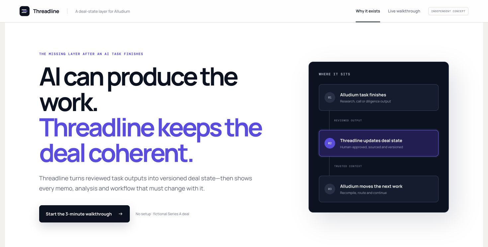

# Threadline

**A deal-state layer for AI-native investment teams.**

[Live product](https://threadline-vc.vercel.app) · [Production architecture](ARCHITECTURE.md)

> Independent concept using fictional AsterOS data. Not affiliated with or integrated into Alludium.



Alludium helps people and agents complete investment work together. Threadline explores the handoff after that work is reviewed: how a material correction becomes shared, versioned deal state before another task relies on it.

## The scenario

An investment screen finds a contradiction:

- The pitch deck reports **€4.2m qualified pipeline**.
- The CRM supports only **€1.8m sales-accepted pipeline**.
- A founder call confirms the two sources use different definitions of “qualified.”

Threadline asks an investor to review the exact evidence. If the correction is approved, it creates a new accepted revision, identifies every output built with the old figure, and rebuilds that work from the corrected state.

```text
reviewed task output
        ↓
proposed correction + evidence
        ↓
human approve / reject
        ↓
accepted revision
        ↓
stale work identified
        ↓
bounded rebuild + verification receipt
```

## What the prototype demonstrates

- AI-proposed values remain outside accepted state until human approval.
- Approval creates an append-only revision; rejection leaves accepted state unchanged.
- Material changes invalidate dependent outputs with an explicit reason.
- Context compilation blocks when required information cannot fit the budget.
- Rebuilt outputs receive deterministic, downloadable verification receipts.
- Revision replay preserves what the firm believed at each point in time.
- Alludium-style task-output ingestion is idempotent.
- Nine domain-invariant tests protect the workflow.

The state engine is implemented in [`core.js`](core.js). External integrations use realistic fixtures because this project has no access to private Alludium APIs or customer data. [`ARCHITECTURE.md`](ARCHITECTURE.md) describes how the concept could become a production platform primitive.

## Run locally

```bash
npm run serve
```

Open `http://localhost:4173`. Run the tests with `npm test`.
