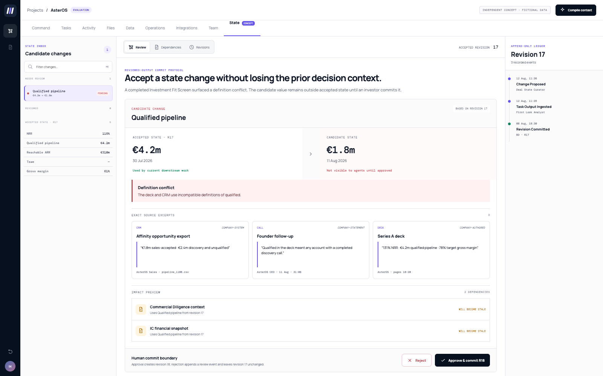

# Threadline

> **Independent concept prototype using fictional AsterOS data. Not affiliated with or integrated into Alludium.**

Threadline is a working Alludium-aligned concept for a **reviewed-output commit protocol** between investment tasks.



Alludium already moves work between tasks. Threadline explores how reviewed outputs could become accepted, versioned deal state. Candidate changes are reconciled, approved and committed before they enter a downstream task context.

## Start here

```bash
npm run serve
```

Open `http://localhost:4173`, then follow this 90-second path:

1. Confirm accepted revision 17 still contains €4.2m qualified pipeline.
2. Review the €1.8m candidate and its exact CRM/call/deck excerpts.
3. Preview the two dependent artifacts that will become stale.
4. Approve and commit revision 18.
5. Recompile Commercial Diligence; try a 900-token budget to see it block.
6. Seal at 2,600 tokens and inspect/download the deterministic receipt.
7. Replay revisions 17 and 18 to recover both accepted values.

## Why it composes with Alludium

- It does not replace screening, diligence, IC memo or portfolio agents.
- It improves the context those agents receive without silently overwriting material facts.
- It preserves human judgment and approval.
- It turns context management into a visible deal-workflow surface.
- It reinforces Alludium's cross-tool, shared-workspace product thesis.

## Run

No install is required. Serve the directory with any static server:

```bash
python3 -m http.server 4173 --directory .
```

Then visit `http://localhost:4173`.

## What is genuinely implemented

- Accepted revisions separated from pending candidate changes.
- An append-only event ledger for proposals, reviews, commits, invalidations and compiled packs.
- Explicit approve/reject human boundaries; rejected candidates never change accepted state.
- Source metadata and exact excerpts without synthetic trust/confidence scores.
- A fail-closed bounded-context compiler with required/optional policy claims.
- Dependency invalidation when a committed claim changes.
- Deterministic receipts containing revision, policy, permissions, exclusions and content hash.
- True revision replay that preserves earlier accepted values.
- Local persistence plus JSON receipt export.
- Eight deterministic domain-invariant tests.

The deterministic domain model lives in `core.js`; the application shell lives in `app.js`. External integrations are represented by realistic fixture payloads, not live connections.

## Tests

```bash
npm test
```
